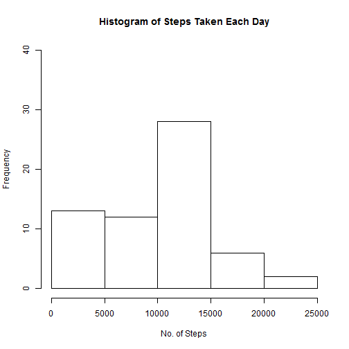
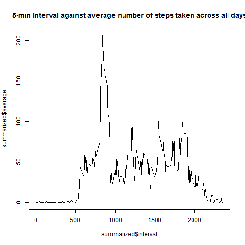
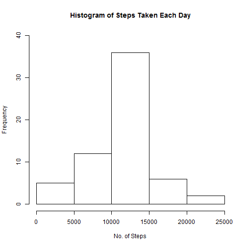
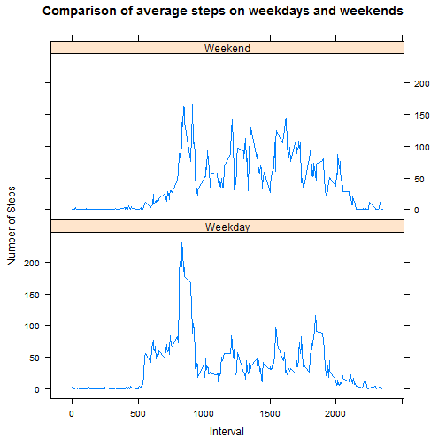

##Reproducible Research Course Project 1 - Activity Monitoring

###Loading and preprocessing the data

Downloading the file


```r
#download, open a temp file and unzip zipped file contents into ./data
setwd("~/../")
if(!file.exists("./data")){dir.create("./data")}
setwd("~/../data")

if(!file.exists("activity.csv")){
temp <- tempfile()
download.file("https://d396qusza40orc.cloudfront.net/repdata%2Fdata%2Factivity.zip",temp)
unzip(zipfile=temp,exdir="./data")
unlink(temp)
}
```

Reading the data

```r
rawdata <- read.csv("activity.csv")
```

###What is mean total number of steps taken per day?

1. Total number of steps per day

```r
sum(rawdata$steps,na.rm = TRUE)
```

```
## [1] 570608
```

2. Histogram of the total number of steps taken each day

```r
library(dplyr)
group_by_day <- group_by(rawdata,date)
summarized_steps_by_day <- summarize(group_by_day, sum = sum(steps,na.rm=TRUE))
hist(summarized_steps_by_day$sum,main = "Histogram of Steps Taken Each Day", xlab = "No. of Steps", ylim = c(0,40))
```



3. Mean of the total number of steps per day

```r
mean(summarized_steps_by_day$sum)
```

```
## [1] 9354.23
```

3. Median number of steps per day

```r
median(summarized_steps_by_day$sum)
```

```
## [1] 10395
```

###What is the average daily activity pattern?
1. Time series plot of the 5-minute interval (x-axis) and the average number of steps taken, averaged across all days (y-axis)


```r
group_by_interval <- group_by(rawdata,interval)
summarized <- summarize(group_by_interval, average = mean(steps, na.rm = TRUE))
plot(summarized$interval,summarized$average, type = "l", main = "5-min Interval against average number of steps taken across all days")
```



2. Which 5-minute interval, on average across all the days in the dataset, contains the maximum number of steps?


```r
summarized[which.max(summarized$average),1]
```

```
## # A tibble: 1 × 1
##   interval
##      <int>
## 1      835
```

###Imputing missing values

1. Calculate and report the total number of missing values in the dataset (i.e. the total number of rows with NAs)

```r
sum(is.na(rawdata$steps))
```

```
## [1] 2304
```

2. Devise a strategy for filling in all of the missing values in the dataset
        Use the mean for the 5-min interval

```r
#using the first 5 min interval 0 as an example
i = 0
rawdata_no_missing_values <- rawdata
        rawdata_no_missing_values[which(rawdata_no_missing_values$interval==i & is.na(rawdata_no_missing_values$steps)),1] <- mean(rawdata_no_missing_values[which(rawdata_no_missing_values$interval==i),1],na.rm=TRUE)
```

3. Create a new dataset that is equal to the original dataset but with the missing data filled in        

```r
rawdata_no_missing_values <- rawdata
i = 0
for (i in 0:max(unique(rawdata_no_missing_values$interval))) {
        rawdata_no_missing_values[which(rawdata_no_missing_values$interval==i & is.na(rawdata_no_missing_values$steps)),1] <- mean(rawdata_no_missing_values[which(rawdata_no_missing_values$interval==i),1],na.rm=TRUE)
        i <- i+5
}
summary(rawdata_no_missing_values)
```

```
##      steps                date          interval     
##  Min.   :  0.00   2012-10-01:  288   Min.   :   0.0  
##  1st Qu.:  0.00   2012-10-02:  288   1st Qu.: 588.8  
##  Median :  0.00   2012-10-03:  288   Median :1177.5  
##  Mean   : 37.38   2012-10-04:  288   Mean   :1177.5  
##  3rd Qu.: 27.00   2012-10-05:  288   3rd Qu.:1766.2  
##  Max.   :806.00   2012-10-06:  288   Max.   :2355.0  
##                   (Other)   :15840
```

4. Make a histogram of the total number of steps taken each day 

```r
group_by_day2 <- group_by(rawdata_no_missing_values,date)
summarized_steps_by_day2 <- summarize(group_by_day2, sum = sum(steps,na.rm=TRUE))
hist(summarized_steps_by_day2$sum,main = "Histogram of Steps Taken Each Day", xlab = "No. of Steps", ylim = c(0,40))
```



4. Calculate and report the mean total number of steps taken per day

```r
mean(summarized_steps_by_day2$sum)
```

```
## [1] 10766.19
```
4. Calculate and report the median total number of steps taken per day

```r
median(summarized_steps_by_day2$sum)
```

```
## [1] 10766.19
```
        Mean and Median increased after imputing missing data on the estimates of the total daily number of steps

###Are there differences in activity patterns between weekdays and weekends?
Create a new factor variable in the dataset with two levels - "weekday" and "weekend" indicating whether a given date is a weekday or weekend day.

```r
library(chron)
library(lattice)
rawdata_no_missing_values$wDay <- factor(chron::is.weekend(rawdata_no_missing_values$date),levels = c(FALSE,TRUE), labels = c("Weekday","Weekend"))
```

Make a panel plot containing a time series plot (i.e. type = "l") of the 5-minute interval (x-axis) and the average number of steps taken, averaged across all weekday days or weekend days (y-axis).

```r
group_by_interval_wDay <- group_by(rawdata_no_missing_values,interval,wDay)
summarized_by_interval_wDay <- summarize(group_by_interval_wDay, mean = mean(steps,na.rm=TRUE))
xyplot(mean~interval|wDay,data = summarized_by_interval_wDay, type = "l", layout = c(1,2), main = "Comparison of average steps on weekdays and weekends", ylab = "Number of Steps", xlab = "Interval")
```


